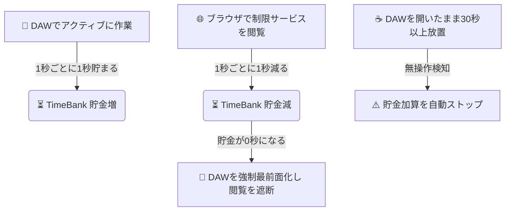

# ⏳ daw-focus-lock

🎹 **DAW作業にコミットするための、娯楽・SNSサービス強制ロックツール**

`daw-focus-lock` は、DTM（音楽制作）中にSNSやYouTubeなどの誘惑に負けず、作業に没頭するために開発されたデスクトップユーティリティです。Tauri v2 + React + TypeScript で構築されており、軽量かつ高速に動作します。

---

## 💡 コンセプト：時間貯金（TimeBank）システム

本アプリは、DAW（音楽制作ソフト）での実際の作業時間を「貯金」し、その貯金の分だけ娯楽サービスを利用できるようにするシステムを採用しています。



1. **時間ビルド (BUILD)**
   DAWソフトをアクティブにしてキーボードやマウスで作業している間、1秒ごとに1秒の「利用可能時間（TimeBank）」がチャージされます。
2. **時間消費 (DRAIN)**
   対象の制限サービス（X, YouTube等）を開いていると、1秒ごとにTimeBankが減少します。
3. **強制ロック (LOCK)**
   TimeBankが `00:00` になった瞬間、現在起動中のDAWソフトが**強制的に画面最前面へ引っ張られ**、娯楽サイトの閲覧が物理的に遮断されます。
4. **放置対策 (IDLE)**
   DAWを開いたままでの完全放置による時間稼ぎを防ぐため、**PC全体で30秒以上の無操作状態を検知すると自動的に加算が停止**します。

---

## 🛡️ 主な機能

- **マルチDAW自動検知 & 最前面化**
  - Studio One / Fender Studio Pro、Cubase、Logic Pro、Ableton Live、FL Studio、Pro Tools などの主要DAWのアクティブ状態を自動検出。
- **柔軟な制限サービス設定**
  - X (Twitter)、YouTube (通常動画)、YouTube Shorts、Instagram、mixi2 などのトグル制御。
  - 各種制限サービスは個別に有効・無効を切り替え可能。
- **クロスプラットフォーム対応 (macOS & Windows)**
  - **macOS**: AppleScriptを活用した高精度なアクティブブラウザURL判定に対応。通常YouTubeとYouTube ShortsをURLで厳密に区別できます。
  - **Windows**: OS制約によるURL取得不可を補う「YouTube/Shortsの一括制限フォールバック」や、裏でサイレントに動作する「PowerShellの非表示実行（一瞬開く黒いウィンドウのポップアップを防止）」を搭載。
- **アクセシビリティ権限の自己診断 (macOS)**
  - macOS特有の「システム環境設定上は権限オンだが実際には他アプリを検出できない（ゴースト状態）」バグを自動検知し、ユーザーに対処手順（解決ガイド）を表示します。

---

## 🛠️ 技術スタック

- **フレームワーク**: Tauri v2
- **バックエンド (Core)**: Rust
- **フロントエンド**: React, TypeScript, Vite
- **デザイン**: CSS (DAWスタジオ・オーディオ機器風ダークテーマ)

---

## 🚀 開発とビルド

### 開発環境の立ち上げ

```bash
# 依存パッケージのインストール
pnpm install

# 開発サーバー起動（ホットリロード有効）
pnpm tauri dev
```

### 本番用パッケージのビルド

```bash
# 各OS向けバイナリのビルド・パッケージング
pnpm tauri build
```

---

## 🚨 macOSで「検出が動作しない」場合の解決手順

macOSの仕様（およびOSのバグ）により、アプリのパスが変わると「システム設定上はアクセシビリティがONに見えても実際には無効化されている」状態になることがあります。その場合は、下記手順でリセットしてください。

1. **「システム設定 ➔ プライバシーとセキュリティ ➔ アクセシビリティ」** を開きます。
2. リストにある `daw-focus-lock` を選択し、**下部の「マイナス（`-`）」ボタンでリストから一度完全に削除**します。
3. 本アプリを `/Applications`（アプリケーション）フォルダに移動させます。
4. システム設定のアクセシビリティ画面で**「プラス（`+`）」ボタン**を押し、`/Applications/daw-focus-lock.app` を手動で選択してリストに追加し、チェックをONにします。
5. アプリをダブルクリックして起動します。
